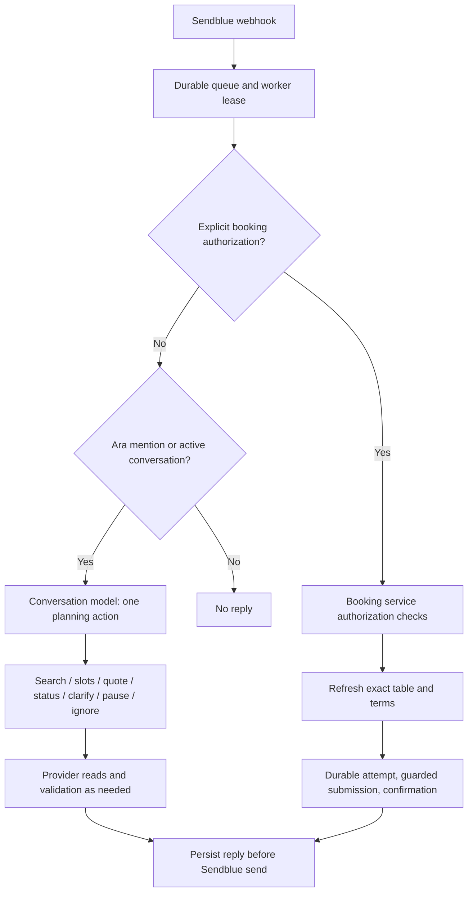

# Ara harness: current implementation

Implementation snapshot: September 25, 2026. This explains the code that runs today; [README](../README.md) remains the product source of truth, and [EXECUTION_PLAN](../EXECUTION_PLAN.md) tracks acceptance. See [browser setup](BROWSER_FALLBACK.md) for configuration.

## What controls what

The harness is application code that connects chat interpretation, provider requests, browser automation, validation, and durable booking state. It is not an unrestricted agent operating a browser until it succeeds.

| Component | Responsibility |
| --- | --- |
| Sendblue webhook and SQLite queue | Receive allowlisted group messages, deduplicate them, and lease work to the worker. |
| Conversation model | Choose one structured planning action from the message, history, and stored restaurant/slot options. |
| Booking service | Enforce owner authorization, quote freshness, exact table and terms, and duplicate protection. |
| Provider router | Use the Resy API first where applicable; select browser fallback for eligible read failures. |
| Steel + Playwright | Run an isolated remote browser, navigate, interact with known controls, and inspect DOM/network evidence. |
| Browser selection model | Resolve ambiguous restaurant discovery results by choosing already-observed candidate IDs. |
| Booking store | Persist quotes, approval boundaries, attempts, and verified confirmations. |

**DOM inspection is performed through Playwright in the same browser.** Browser control means actions such as navigation, filling a search box, scrolling, or clicking a known control. DOM inspection means reading the rendered document and validating its contents. Both can happen within the deterministic stage. Neither requires an LLM or a screenshot.

## End-to-end chat flow

1. The worker processes the single allowlisted pilot group. AI and live booking have separate enable flags.
2. An explicit authorization phrase is routed directly to application code. Otherwise, Ara responds to its name or an active planning conversation (30 minutes); unrelated chatter can still be ignored.
3. The conversation model receives recent history with sender aliases, current venue options, and slots without private inventory tokens. It returns exactly one `plan_step`: `ignore`, `clarify`, `search`, `slots`, `quote`, `status`, or `pause`. There is no model `book` action.
4. Search returns up to five restaurants. A later turn selects a known restaurant and checks an exact date and party size. Slots are sorted around the requested time, if supplied, and limited to five chat options. Selecting a real slot opens the quote flow.
5. Application code formats provider results and booking confirmations. The reply is stored before sending, so retrying a rejected Sendblue send does not rerun an already-generated booking response. Uncertain sends are held rather than automatically replayed.

This is one planning action per message, not a continuous multi-tool reasoning loop. The chat model and the browser candidate-selection model are separate calls with different permissions.

## When API requests become browser requests

The existing Resy adapter uses authenticated web endpoints. It is not established official partner API access.

`FallbackProvider` tries the API for search and API-originated slot/details reads. Browser fallback is eligible for schema-validation failures or non-uncertain errors matching:

- Access denied, unreachable, or invalid response.
- HTTP 404, 408, 429, or 5xx.
- Unsupported terms or unsupported Resy time format.

A successful empty API response is a result, not a reason to open a browser. Authentication expiry and errors outside the eligible set propagate rather than automatically switching transports.

Once a venue comes from browser discovery, its slot and details requests stay in the browser. Its generated ID is not treated as a real API venue ID. Booking uses the transport recorded by its details; **an attempted API booking never falls back to browser submission**. Reservation-list fallback ends in a human handoff because browser reservation reconciliation is not implemented.

## Discovery: the full escalation ladder

Restaurant search implements the following sequence. It stops at the first verified result, including a verified empty result. A thrown error exits the ladder; later stages are not a universal recovery mechanism.

| Stage | What actually happens | When it advances |
| --- | --- | --- |
| Deterministic Playwright | Navigate to the configured Resy city search URL; fill and submit an accessible search box if found; wait for venue links; inspect the DOM. Accept candidates when the search value matches the query. | No verified result returned. |
| DOM inspection | Read the page again. Check explicit no-results text, an exact restaurant-name match with the matching query URL, or a matching “results for” heading. | These rules cannot establish a result. |
| Small DOM summary → LLM | If enabled and candidates exist, send bounded, redacted text and observed candidate IDs/names/URLs. The model selects up to five IDs. | No usable candidate selection. |
| Screenshot-assisted selection | If separately enabled and candidates exist, capture one masked JPEG and ask the same restricted selector to choose observed IDs. | No usable selection, or stage disabled. |
| Human handoff | Return a Resy link and explain that the check could not be verified. | Automation stops. |

The selector cannot invent URLs, discover new candidates from the screenshot, click coordinates, fill arbitrary forms, infer table availability, or book. The screenshot stage is visual assistance for selection, **not an autonomous computer-use loop**.

Discovery extraction examines visible venue links, removes common private/form/navigation elements from its text summary, and redacts token/email/phone-like text. It retains at most 20 candidate venues and 4,000 text characters. Model input uses at most 3,000 text characters and a 6,000-character serialized text payload; each selector response has a 400-token output cap. Screenshots mask inputs and common private elements and are held in memory, not written to disk by this code. These are bounded redaction measures, not a guarantee that arbitrary page text contains no personal information.

## Availability: deterministic navigation and DOM validation

Availability does **not** use the discovery LLM or screenshot stages.

1. Open the canonical venue URL with the requested `date` and `seats` parameters in Steel.
2. Wait for the guest selector. Check that the browser remains at the expected venue/date/party URL.
3. Read the venue heading, selected date label, party size, time filter, loading indicators, and visible reservation buttons.
4. Require the expected venue heading, exact date, exact party size, `All Day` time filter, and no visible loading state.
5. For every enabled slot, compare its displayed time/seating with the inventory tuple embedded in its DOM test ID. Verify both inventory dates, time, party size, and consistent venue inventory IDs. Preserve distinct seating options at the same time.
6. Require two matching parsed snapshots, polling every 400 ms for up to 20 seconds after initial navigation/control setup.

The CheLi Manhattan exception is a narrowly scoped, observed alias: displayed `cheli` corresponds to inventory `Table`. Other label mismatches still fail validation. The displayed label and original inventory token are preserved.

No slot is clicked during an availability lookup. Missing buttons or an incomplete page do not prove that a restaurant is sold out; the adapter hands off. A challenge, login requirement, or unsupported layout also stops automation. There is no model-based guessing when these checks fail.

## Quote: controlled browser interactions, local financial checks

For a browser-originated slot, requesting terms opens a fresh Steel session and rechecks availability. The code then:

1. Finds the exact time and seating, and requires one matching reservation button.
2. Dismisses the known cookie prompt if visible and clicks that slot to open checkout.
3. Requires one Resy widget frame and the expected Reserve Now control.
4. Scrolls the outer iframe and button into view. Playwright trial clicks check actionability without submitting; positioning can retry up to four times. It unchecks the known marketing opt-in when present and checked.
5. Reads the checkout DOM locally and verifies restaurant, date, time, guest count, seating, and one cancellation policy.
6. Observes the browser's own successful `/3/details` response for the exact inventory token. Parses payment and cancellation fields locally and cross-checks them against the displayed policy.

This path combines DOM evidence with structured network evidence from the website. Falling back from direct API requests does not mean ignoring the browser's API responses.

Supported terms are deliberately narrow: understood zero-upfront-payment, ordinary reservation contracts with either the validated conditional cancellation-fee wording or the validated no-charge/24-hour-notice wording. Unknown financial fields, unsupported policies, or mismatched evidence hand off. A missing saved payment method produces a setup message instead of an actionable quote. Checkout data is not sent to an LLM, and checkout screenshots are not used.

The quote records the exact slot and a fingerprint of account context and relevant terms. Browser details return an opaque, in-memory ticket rather than exposing the real booking token. The browser session closes after reading terms; a quote neither holds nor books the table.

## Authorization, submission, and uncertain outcomes

For the normal group flow, only the configured booking owner may authorize a quote already delivered in that group. Browser quotes require the explicit phrase shown in chat:

> Ara, book QUOTECODE and I accept the displayed fees and cancellation terms

The service checks duplicate/unresolved attempts, the live-booking flag, quote expiry, fresh exact inventory, payment evidence, and an unchanged terms fingerprint and transport. It never substitutes a nearby time. Before invoking submission, it durably records an `unknown` attempt.

The browser booking adapter consumes the private ticket, opens another checkout, and verifies the current account, terms, and expiry again. Its one-use gate allows only the expected `POST https://api.resy.com/3/book`, from the Resy widget origin, with the exact current booking token before expiry. Only then does it click Reserve Now. Confirmation requires a valid provider reservation reference or management token; a click or HTTP 200 alone is insufficient.

- Verified confirmation → persist `confirmed`, then report it to the group.
- Recognized checkout preparation failure before submission → record `not_booked` with evidence.
- Other failures after entering the attempt boundary → retain `unknown` and block another booking until reconciled. This is intentionally conservative even if some such errors occurred before an actual request.

Unresolved browser bookings require private owner/operator reconciliation. The regular group status flow does not automatically clear them. A previously confirmed status reports the stored outcome and directs the owner to Resy for later changes/cancellation.

Availability and terms handoffs say that no booking was attempted. Uncertain-submission messages explicitly warn that a booking may exist and must not be retried.

## Worker, Codex MCP, and operator tools are different paths

| Path | Capabilities and limits |
| --- | --- |
| Background worker | Runs the chat flow above. Its browser selection model cannot control arbitrary UI. Booking requires the separate application authorization path and enable flag. |
| Codex MCP (`scripts/browser-mcp.ts`) | Seven tools: `start`, `navigate`, `inspect_dom`, `open_venue`, `search`, `screenshot`, `release`. Navigation is restricted; opening a venue requires an ID from a fresh inspection. No generic click, coordinate control, or booking tool. |
| Browser CLI (`scripts/browser.ts`) | Direct browser diagnostics/setup, including private login, search, availability, and quote checks. These bypass API-first routing to test the browser adapter itself. |
| Approved operator runner (`scripts/book-approved.ts`) | Separate explicitly authorized booking path. Validates reviewed terms and writes the durable attempt before submission, using one prepared checkout session through confirmation. This is the path that completed the controlled Mira test. |
| Diagnostic/reconciliation scripts | Inspect availability or blocked checkout behavior, and reconcile held attempts using provider evidence and required owner confirmation. They are not an automatic recovery loop in the worker. |

The MCP allows 20 guarded actions per session and one screenshot, with a preceding DOM inspection and a supplied reason. Its screenshot flag must be enabled. Codex is not automatically invoked by the worker when a browser step fails.

## Isolation, costs, and current validation

Each normal browser operation opens a Steel cloud session with a 90-second provider TTL and connects Playwright over CDP. Manual login gets five minutes. The owner's saved Steel session context is encrypted in SQLite and supplied to new sessions; Ara does not attach to a personal browser. Sessions are released in cleanup, with a separate 60-second release timeout; provider TTL is the backstop if release fails.

Discovery sessions block known reservation mutation endpoints and restrict top-level navigation. Checkout adds a narrower request allowlist and the token-bound submission gate. Login, OTP, payment setup, challenges, and unsupported checkout contracts require human involvement; CAPTCHA solving is disabled.

Browser model escalation has a persistent budget of 10 attempted calls per UTC day by default. A search can spend one DOM-selector call and one image-selector call; failures count. **This budget does not cap ordinary chat interpretation calls or Steel browser usage.** Deterministic DOM work avoids model tokens but still consumes browser runtime. The group booking flow can open several sessions for quote creation, refreshed availability/details, and final checkout.

At this snapshot, AI messaging and browser fallback are enabled for the pilot; DOM selection is enabled, screenshots are disabled, and live group bookings are disabled. These are deployment settings, not permanent product guarantees. Code changes and environment changes require restarting the worker.

Validated evidence includes live discovery/availability, the CheLi label correction, and one explicitly approved Mira booking through the operator runner. The full group quote → owner approval → submission → group confirmation acceptance test remains pending. CheLi availability success does not establish CheLi checkout support. The current automated suite has 105 passing tests; fixtures and unit tests do not establish support for every live Resy layout or financial policy.

## Code map

| Concern | Source |
| --- | --- |
| Worker and conversation actions | [worker.ts](../scripts/worker.ts), [agent.ts](../src/lib/booking/agent.ts) |
| Reply persistence and send boundary | [processor.ts](../src/lib/messaging/processor.ts) |
| Authorization, quote, booking, status | [service.ts](../src/lib/booking/service.ts), [store.ts](../src/lib/booking/store.ts) |
| API/browser routing | [fallback.ts](../src/lib/booking/fallback.ts), [factory.ts](../src/lib/booking/browser/factory.ts) |
| Search ladder and restrictions | [provider.ts](../src/lib/booking/browser/provider.ts), [policy.ts](../src/lib/booking/browser/policy.ts) |
| DOM summaries and candidate model | [dom.ts](../src/lib/booking/browser/dom.ts), [model.ts](../src/lib/booking/browser/model.ts) |
| Availability verification | [availability.ts](../src/lib/booking/browser/availability.ts) |
| Checkout and one-use submission | [checkout.ts](../src/lib/booking/browser/checkout.ts), [checkout-validation.ts](../src/lib/booking/browser/checkout-validation.ts) |
| Steel lifecycle and browser budget | [steel.ts](../src/lib/booking/browser/steel.ts), [config.ts](../src/lib/booking/browser/config.ts) |
| Codex remote-browser tools | [browser-mcp.ts](../scripts/browser-mcp.ts) |
